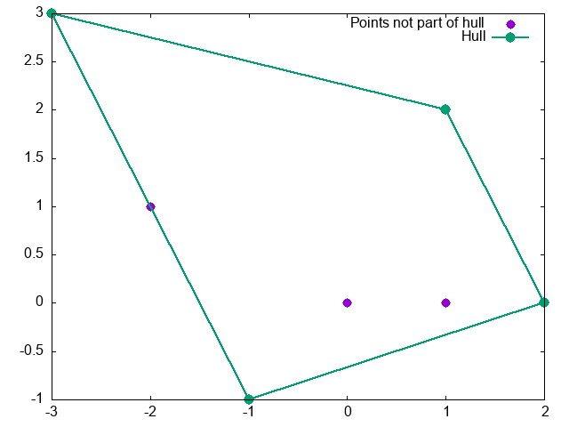

# Convex Hull
Haskell functions for computing the convex hull of a set of points. 
The set of points is read from a text file, the resulting convex hull is
written to a text file. Additionally, a graph showint the points and their
convex hull is generated

The text of the input file must obey the "point list syntax":
* First line: the number of points
* Following lines: The points. Each line contains 2 strings, corresponding to x- and y-coordinate. The coordinates must be integers.

The text of the output file will obey this syntax, too.
The graph is written to a PNG file.

The folder testfiles contains a few samples.

Example: 
```
$ ./main "testfiles/tc7ss.txt" "testfiles/tc7ss.out.txt" "testfiles/tc7ss.png"

    Input          Output
    7              4
    0 0            -1 -1
    1 0            2 0
    2 0            1 2
     1 2           -3 3
    -1 -1 
    -2  1
    -3 3
```


Note: 
1. Only points with integer coordinates are accepted. This is no restriction of generality, as any finite set of fractional numbers has a lcm of the denominators.
2. The order of the points is irrelevant in the input file, but relevant (up to a cyclic shift) in the output file.
3. The algorithm computes a minimal convex hull. This means a point lying on a straight line, that
connects two points of the convex hull, is itself not part of the convex hull. E.g. see the point (-2,1) in the graph above.


